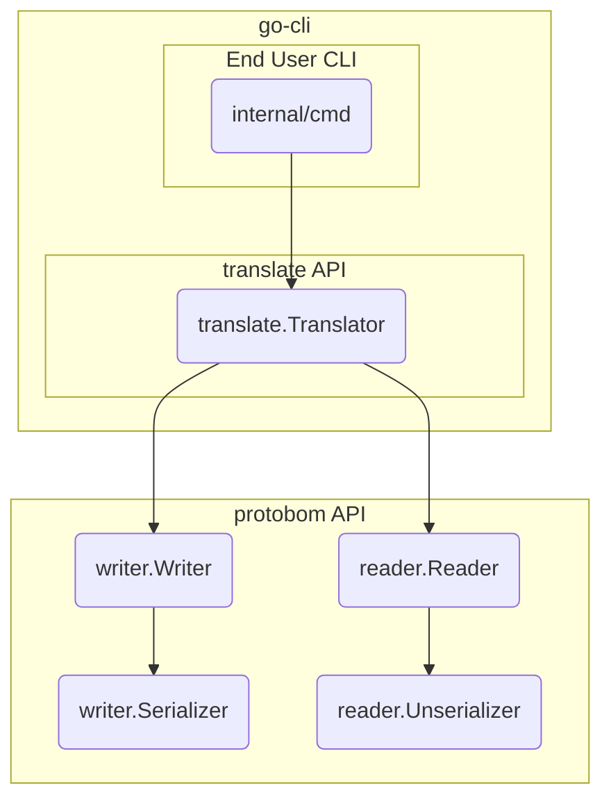

# SBOM Convert CLI
This reporistory contains a command line interface (cli), based on the [protobom](https://github.com/bom-squad/protobom) library, that converts SBOMs across formats (SPDX and CycloneDX).

## Usage

### Commands
`sbom-convert convert [input] [flags]`
`sbom-convert [input] [flags]`

### Input
The `convert` command takes in a single - as of now - json file in either SPDX or CycloneDX format, and outputs an SBOM in a different format. 
- The file must be json
- The file must be a valid CycloneDX / SPDX document

### Flags
- `-e`, `--encoding`: (string) The output encoding [spdx: [text, json] cyclonedx: [json] (default "json")
- `-f`, `--format`: (string) The output format [spdx, spdx-2.3, cyclonedx, cyclonedx-1.4]
- `-h`, `--help`:` help for convert
- `-o`, `--output`:  (string) Path to write the converted SBOM. Default: stdout. 

Global Flags:
`-c`, `--config`: (string) Path to config file
`-v`, `--verbose`: log verbosity level (-v=info, -vv=debug, -vvv=trace)

### Examples
`sbom-convert convert sbom.cdx.json`                     output to stdout in inverse format  

`sbom-convert convert sbom.spdx.json -o sbom.cdx.json`   output to a file  

`sbom-convert convert sbom.cdx.json -f spdx-2.3`         select a specific target format  

`sbom-convert convert sbom.cdx.json -f spdx -e text`   	 select specific encoding  

## Architecture 

The architecture of the CLI looks more or less like this:

