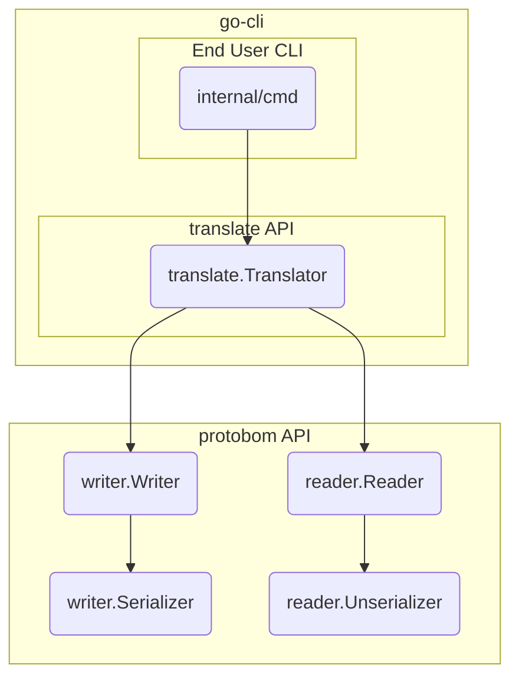

# protobom demo CLI

This repository contains an example CLI and translation API based on the protobom 
[protobom](https://github.com/bom-squad/protobom) libraries. The intent of this repo
is to propose a clear separation between two API levels and the CLI.

The CLI implemented in this repo adds on top of the protobom API
and defines an exportable `translate` package that has a very simple 
object to perform the translation.

The architecture of the CLI looks more or less like this:




## Demo CLI Utility

The utility has a single `translate` subcommand. In its simplest invocation
it will read an SBOM from the first argument, and translate to the "inverse"
format. The translate package defines a default version and encoding of both
CycloneDX and SPDX. If the CLI ingests an SBOM of one format, it will output
to the default version of the other. Another format can be specified too 
using the `--format` flag:


```
translate an SBOM into another format

Usage:
  protobom translate [flags] sbom.json

Examples:
protobom translate sbom.spdx.json

Flags:
      --format string   format string
  -h, --help            help for translate
  -o, --output string   path to write the ranslated SBOM

Global Flags:
      --log-level string   the logging verbosity, either 'panic', 'fatal', 'error', 'warning', 'info', 'debug', 'trace' (default "info")

```

Here is a sample run ingesting the SPDX document in the samples directory:

```
❯ protobom translate samples/bom.spdx.json --log-level=debug
DEBU Setting commands globally into verbose mode  
DEBU Using log level "debug"                       file="cmd/root.go:41"
format: text/spdx version: 2.3 encoding: json
DEBU computing inverse format: application/vnd.cyclonedx+json;version=1.4  file="pkg/implementation.go:89"
format: text/spdx version: 2.3 encoding: json
INFO Serializing to application/vnd.cyclonedx+json;version=1.4  file="writer/implementation.go:25"
{
  "$schema": "http://cyclonedx.org/schema/bom-1.4.schema.json",
  "bomFormat": "CycloneDX",
  "specVersion": "1.4",
  "serialNumber": "DOCUMENT",
  "version": 0,
  "metadata": {
    "component": {
      "bom-ref": "Package-bom",
      "type": "application",
      "name": "bom"
    }
  },
  "components": [
    {
      "bom-ref": "File-bom-pkg-spdx-builder.go",
      "type": "file",
      "name": "pkg/spdx/builder.go",
      "hashes": [
        {
          "alg": "SHA-1",
          "content": "32af993bd82ccc44170a1ad3b04e9c04e3e74b6c"
        },
        {
          "alg": "SHA-256",
          "content": "f66491006d1f4932b9e118fc601b893ba6a45883852ed784357cf154f183f537"
        },
        {
          "alg": "SHA-512",
          "content": "664b654b06874cd4c8ea95073bcbae84ce934e25211075e355c40e3e7bbdb9b1722a8eb8f5456321c87890859571b96f9f1b309c854b2a9397ed1027da8fd79a"
        }
      ],
      "licenses": [
        {
          "license": {
            "id": "NONE"
          }
        }
      ]
    },
.....
```

## Translation API

For reference of future projects that extend this, the heavy lifting of the
translation is done in the
[TranslateWithOptions function](https://github.com/bom-squad/go-cli/blob/5d319af02fd7841016b69c4561df019d81b003cb/pkg/translate.go#L63-L86)
(and the package implementation):

```golang
// TranslateWithOptions reads an SBOM from stream in and translates it applying
// options o.
func (t *Translator) TranslateWithOptions(o *TranslationOptions, in io.ReadSeekCloser, out io.WriteCloser) error {
        // Since we are modifying the options, copy them here
        opts := *o


        // Compute the translation format from the specified options
        if err := t.impl.ComputeTranslationFormat(&opts, in); err != nil {
                return fmt.Errorf("computing detination format")
        }


        // Ingest the SBOM from the stream
        doc, err := t.impl.IngestSBOM(&opts, in)
        if err != nil {
                return fmt.Errorf("ingesting SBOM: %w", err)
        }


        // Serialize it to the out stream in the new format
        if err := t.impl.SerializeSBOM(&opts, doc, out); err != nil {
                return fmt.Errorf("serializing SBOM: %w", err)
        }


        return nil
}
```
